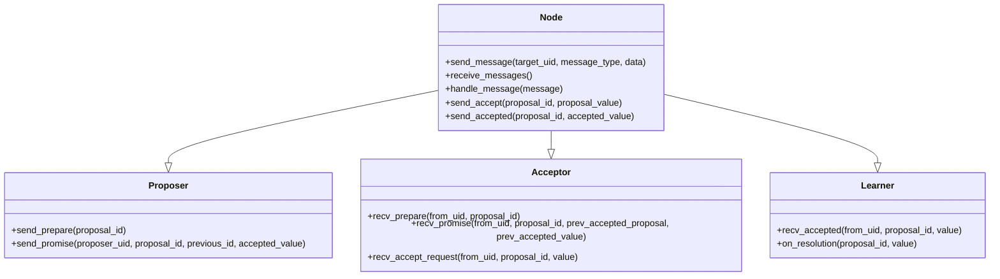

# Paxos Algorithm Implementation

Este projeto implementa um nó Paxos com comunicação por sockets. O algoritmo Paxos é utilizado para alcançar consenso em sistemas distribuídos. Cada nó pode atuar como um Proposer, Acceptor e Learner, comunicando-se com outros nós via sockets UDP.

## Estrutura do Projeto

O projeto é composto por três componentes principais, herdados pela classe `Node`:

- **Proposer**: Responsável por propor valores para consenso.
- **Acceptor**: Recebe e aceita propostas de consenso.
- **Learner**: Aprende o valor que foi aceito pela maioria dos Acceptors.

## Arquitetura

Cada nó mantém uma lista de vizinhos, com seus respectivos IPs e portas, para enviar e receber mensagens. A comunicação é feita em JSON, e cada mensagem tem um tipo específico como 'prepare', 'promise', 'accept' e 'accepted'.

### Fluxo de Mensagens

1. O **Proposer** envia uma mensagem de `prepare` aos **Acceptors**.
2. Os **Acceptors** respondem com uma mensagem de `promise`, contendo a proposta mais recente aceita (se houver).
3. O **Proposer** então envia uma mensagem de `accept` com o valor da proposta.
4. Finalmente, os **Acceptors** enviam uma mensagem de `accepted` para confirmar o valor.

### Diagrama UML


### Execução

Como rodar?
- Clone o repositório.
- Crie os nós modificando os parâmetros de porta e IP, se necessário.
- Execute os nós simultaneamente para observar o processo de consenso.

Cada nó é criado com um identificador único, uma porta, e uma lista de vizinhos (UID, IP, porta). As mensagens são enviadas entre os nós para alcançar consenso. Exemplo para criação de nós:

```python
from node import Node

node1 = Node(1, 10001, {2: ('localhost', 10002), 3: ('localhost', 10003)})
node2 = Node(2, 10002, {1: ('localhost', 10001), 3: ('localhost', 10003)})
node3 = Node(3, 10003, {1: ('localhost', 10001), 2: ('localhost', 10002)})

node1.set_proposal("Value A")
node1.prepare()
```

Contribuição

Sinta-se à vontade para abrir issues ou enviar pull requests para melhorias ou correções.
